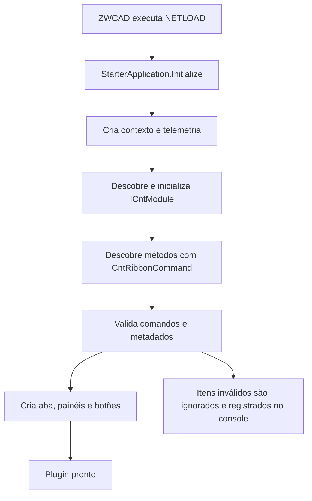

# CEP-CAD

Plugin .NET modular para automatizar rotinas do ZWCAD. A solução foi desenhada para que cada comando seja pequeno na entrada, tenha dependências explícitas e concentre as regras de negócio em classes simples, separadas da API do CAD e da interface.

Este README é o contrato técnico do repositório. Uma pessoa ou agente deve conseguir implementar um novo comando seguindo somente as instruções abaixo, sem alterar a infraestrutura central quando isso não for necessário.

## Sumário

- [O que existe hoje](#o-que-existe-hoje)
- [Tecnologias e pré-requisitos](#tecnologias-e-pré-requisitos)
- [Compatibilidade e versionamento do ZWCAD](#compatibilidade-e-versionamento-do-zwcad)
- [Compilar e carregar no ZWCAD](#compilar-e-carregar-no-zwcad)
- [Como a aplicação inicia](#como-a-aplicação-inicia)
- [Como funciona a injeção de dependências](#como-funciona-a-injeção-de-dependências)
- [Como um comando é executado](#como-um-comando-é-executado)
- [Como o comando aparece no ZWCAD](#como-o-comando-aparece-no-zwcad)
- [Arquitetura e responsabilidades](#arquitetura-e-responsabilidades)
- [Comandos existentes](#comandos-existentes)
- [Como implementar um novo comando](#como-implementar-um-novo-comando)
- [Clean Code e decisões obrigatórias](#clean-code-e-decisões-obrigatórias)
- [Segurança ao trabalhar com o desenho](#segurança-ao-trabalhar-com-o-desenho)
- [Validação e diagnóstico](#validação-e-diagnóstico)
- [Checklist para agentes](#checklist-para-agentes)

## O que existe hoje

| Comando | Botão | Responsabilidade |
|---|---|---|
| `CNT_PLUGIN_STATUS` | **Status do plugin** | Confirma que a DLL, os módulos e a Ribbon foram inicializados. |
| `CNT_INSERT_NOTES` | **Inserir notas** | Abre a seleção hierárquica de disciplina, etapa, importância e notas opcionais. |
| `CNT_PLOT_FOLHAS` | **Plotar folhas** | Localiza folhas no layout, valida formatos e nomes, salva a nomenclatura, gera PDFs e exporta DWGs individuais. |

Os três comandos podem ser chamados pela linha de comando do ZWCAD. Seus botões são criados automaticamente na aba **CNT** da Ribbon.

## Tecnologias e pré-requisitos

- Windows x64.
- ZWCAD 2024 com a API .NET instalada, obrigatório para desenvolvimento e validação principal.
- ZWCAD 2025 somente quando for necessário validar ou gerar o pacote específico dessa versão.
- .NET Framework 4.8.
- Visual Studio com as ferramentas de desenvolvimento para .NET Framework e WPF.
- As DLLs `ZwDatabaseMgd.dll`, `ZwManaged.dll` e `ZdWindows.dll` da versão de destino do ZWCAD.

O projeto usa o formato clássico de `.csproj`, C# 7.3 e WPF. A instalação-base usada pelos perfis oficiais de desenvolvimento é:

```text
%ProgramW6432%\ZWSOFT\ZWCAD 2024
```

É possível informar uma pasta de instalação não padrão por meio da propriedade MSBuild `ZwcadInstallDir`, mas ela deve continuar apontando para o ZWCAD 2024 durante o desenvolvimento normal.

> `dotnet build` não é o comando de referência deste projeto. Para projetos clássicos WPF/.NET Framework, use o MSBuild instalado pelo Visual Studio; caso contrário, o código gerado pelo XAML pode não ser produzido e surgirão erros como `InitializeComponent não existe`.

## Compatibilidade e versionamento do ZWCAD

**O ZWCAD 2024 é a versão-base obrigatória do projeto. Todo código novo deve ser projetado, compilado e validado primeiro contra as DLLs do ZWCAD 2024.**

O suporte a versões mais novas não muda essa base. As APIs `ZwManaged`, `ZwDatabaseMgd` e `ZdWindows` possuem versões de assembly diferentes entre o ZWCAD 2024 e o 2025; por isso, cada versão suportada deve receber um binário próprio, mesmo quando o código-fonte for o mesmo.

Regras obrigatórias:

1. Use apenas APIs disponíveis no ZWCAD 2024 no código compartilhado.
2. Não introduza uma dependência exclusiva do ZWCAD 2025 em uma classe comum.
3. Quando uma versão mais nova exigir comportamento diferente, isole a integração em um adaptador pequeno. Use compilação condicional (`ZWCAD2024`, `ZWCAD2025`) somente quando a diferença de API não puder ser encapsulada de forma mais simples.
4. Mantenha um único código-fonte e o branch `main`; não crie branches permanentes por versão do ZWCAD.
5. Versione o plugin uma única vez, preferencialmente com SemVer, e gere um pacote por versão do host:

```text
PluginConceito-1.3.0-ZWCAD2024.zip
PluginConceito-1.3.0-ZWCAD2025.zip
```

6. Uma funcionalidade não está pronta enquanto não compilar e funcionar no ZWCAD 2024. A validação no 2025 é adicional e não substitui a validação da versão-base.

A decisão completa e suas consequências estão registradas em `CONTEXTO-COMPATIBILIDADE-ZWCAD.md`.

## Compilar e carregar no ZWCAD

### Compilação no Visual Studio

1. Abra `PluginConceito/PluginConceito.slnx`.
2. Para desenvolver, selecione `Debug2024` e a plataforma `x64`.
3. Para gerar o binário otimizado, selecione `Release2024` e a plataforma `x64`.
4. Compile a solução.

Perfis oficiais:

| Perfil | Finalidade | Referências | Saída |
|---|---|---|---|
| `Debug2024` | Desenvolvimento e depuração | DLLs do ZWCAD 2024 | `PluginConceito/bin/ZWCAD2024/Debug/` |
| `Release2024` | Pacote otimizado | DLLs do ZWCAD 2024 | `PluginConceito/bin/ZWCAD2024/Release/` |

Ao iniciar `Debug2024` com F5, o Visual Studio abre:

```text
%ProgramW6432%\ZWSOFT\ZWCAD 2024\ZWCAD.exe
```

Exemplo pela linha de comando, ajustando o caminho do MSBuild conforme a instalação local:

```powershell
& "C:\Program Files\Microsoft Visual Studio\18\Community\MSBuild\Current\Bin\MSBuild.exe" `
  .\PluginConceito\PluginConceito.slnx `
  /t:Rebuild /p:Configuration=Debug2024 /p:Platform=x64
```

Para uma instalação do ZWCAD 2024 em outra pasta:

```powershell
& "CAMINHO_DO_MSBUILD\MSBuild.exe" `
  .\PluginConceito\PluginConceito.csproj `
  /t:Rebuild /p:Configuration=Debug2024 /p:Platform=x64 `
  /p:ZwcadInstallDir="D:\Aplicativos\ZWCAD 2024"
```

### Carregamento manual

1. Abra o ZWCAD.
2. Execute `NETLOAD`.
3. Selecione `PluginConceito.dll`.
4. Verifique no console a mensagem iniciada por `[CNT] Plugin inicializado`.
5. Execute `CNT_PLUGIN_STATUS` para confirmar o carregamento completo.

`StarterApplication` possui o atributo de assembly `ExtensionApplication`; por isso o ZWCAD chama `Initialize()` assim que a DLL é carregada.

### Carregamento automático

Os arquivos LISP na raiz automatizam o `NETLOAD`:

- `CarregarPluginConceito.lsp`: carregador legado do ambiente local no ZWCAD 2025; não é a referência de desenvolvimento;
- `CarregarPluginConceito_2024.lsp`: carregamento direto de uma DLL de rede;
- `CarregarPluginConceito_2024_RedeParaLocal.lsp`: copia DLL/PDB da rede para uma pasta local versionada e depois carrega a cópia, evitando bloquear a DLL central.

Adicione o LISP apropriado ao **Startup Suite** do ZWCAD. Antes de usar, altere os caminhos fixos de DLL/rede para o ambiente de destino. O carregador preserva os valores anteriores de `FILEDIA` e `CMDDIA`, inclusive durante o fluxo normal de carregamento.

## Como a aplicação inicia

O ponto de composição é `Application/Bootstrap/StarterApplication.cs`.



O fluxo real é:

1. `ZwcadContext` encapsula o documento ativo e a escrita no console.
2. `ZwcadTelemetry` registra eventos e erros no console do ZWCAD.
3. `ModuleContext` reúne `IZwcadContext` e `ITelemetry`.
4. `ModuleDiscovery` encontra todas as classes concretas que implementam `ICntModule`, em ordem determinística pelo nome completo.
5. Cada módulo é instanciado por construtor público sem parâmetros e recebe `IModuleContext` em `Initialize`.
6. `RibbonDiscovery` encontra métodos marcados com `CntRibbonCommand`.
7. `RibbonValidator` elimina definições inválidas e escreve os motivos no console.
8. `RibbonHost` cria ou reutiliza abas e painéis, evitando botões duplicados.
9. Se a Ribbon ainda não estiver disponível, o plugin aguarda o evento `Application.Idle` e tenta novamente. Ao finalizar, remove essa inscrição.

Uma falha na inicialização de um módulo é registrada pela telemetria e não impede que os demais módulos sejam tentados.

## Como funciona a injeção de dependências

Há dois conceitos diferentes que não devem ser confundidos:

1. **Carregamento no ZWCAD:** a DLL entra no processo pelo comando `NETLOAD`; o atributo `ExtensionApplication` informa a classe de inicialização.
2. **Injeção de dependências do código:** objetos são construídos no ponto de composição e entregues por interfaces/construtores. Não existe injeção automática por atributos nem um contêiner externo.

### Contexto compartilhado

`StarterApplication.Initialize()` cria uma única instância do contexto do ZWCAD e da telemetria. Essas dependências são expostas diretamente por `IModuleContext`:

```csharp
public interface IModuleContext
{
    ITelemetry Telemetry { get; }
    IZwcadContext Zwcad { get; }
}
```

Não há contêiner de serviços: o contexto mantém explícitas somente as dependências realmente compartilhadas.

### Dependências de cada módulo

Cada módulo recebe `IModuleContext` e monta internamente o seu grafo de objetos. Exemplo conceitual:

```text
Módulo
└── Handler/orquestrador
    ├── serviço de aplicação
    ├── serviço de domínio
    ├── adaptador da API ZWCAD
    └── interface/contexto compartilhado
```

Esse é o padrão de composição manual adotado pelo repositório. Dependências obrigatórias devem entrar pelo construtor e ser validadas com `ArgumentNullException`. Não use `new` espalhado por eventos, métodos de domínio ou comandos. Concentre a montagem no `Initialize` do módulo ou em uma classe `*CompositionRoot`.

Só adicione uma dependência ao `IModuleContext` quando ela for realmente compartilhada por vários módulos ou fizer parte da infraestrutura. Serviços específicos de um comando devem permanecer dentro do módulo.

## Como um comando é executado

Um comando tem quatro papéis separados:


1. **Classe `*Command`:** adaptador mínimo exigido pelo ZWCAD. Declara o nome e delega imediatamente.
2. **Classe `*Module`:** participa do ciclo de inicialização e mantém o handler já composto.
3. **Classe `*Handler`:** orquestra o caso de uso, trata a fronteira de erro e emite telemetria.
4. **Serviços/domínio:** executam validações, cálculos, leitura/escrita e regras específicas.

Ao clicar em um botão, `ZwcadCommandDispatcher` envia `CommandName + " "` ao documento ativo com `SendStringToExecute`. O ZWCAD então localiza o método marcado com `CommandMethod`. Digitar o nome no console pula somente a etapa do botão; todo o restante é idêntico.

O método de comando não deve conter regra de negócio, abrir transações complexas, criar a UI ou montar dezenas de dependências.

## Como o comando aparece no ZWCAD

O método precisa ter **os dois atributos** e ambos devem usar exatamente o mesmo nome:

```csharp
[CommandMethod(CommandName)]
[CntRibbonCommand(CommandName, /* metadados */)]
public void Execute()
{
    MeuModulo.Execute();
}
```

`CommandMethod` registra o comando no mecanismo do ZWCAD. `CntRibbonCommand` permite que a infraestrutura crie o botão. Um comando pode existir no console sem Ribbon se tiver apenas `CommandMethod`, mas esse não é o padrão para comandos voltados ao usuário deste repositório.

### Campos obrigatórios da Ribbon

| Campo | Regra | Exemplo |
|---|---|---|
| `CommandName` | Único e igual ao `GlobalName` de `CommandMethod`. | `CNT_MEU_COMANDO` |
| `ButtonId` | Único em todo o assembly. | `CNT_MEU_COMANDO_BUTTON` |
| `DisplayName` | Texto visível do botão. | `Meu comando` |
| `TabId` | ID estável da aba. Reutilize `CNT_GERAL` para a aba principal. | `CNT_GERAL` |
| `TabTitle` | Mesmo título para todos que compartilham o `TabId`. | `CNT` |
| `PanelId` | ID estável do painel. | `CNT_UTILIDADES` |
| `PanelTitle` | Mesmo título para todos que compartilham aba/painel. | `Utilidades` |
| `ToolTip` | Explica o resultado e, quando útil, a condição de uso. | `Executa...` |
| `Order` | Ordenação global crescente antes do agrupamento. | `30` |
| `Size` | Valor válido de `RibbonItemSize`. | `Large` |
| `IconResource` | Opcional; deve existir como recurso incorporado. | `...Resources.Icon.png` |

O método deve ser público, retornar `void` e não receber parâmetros. Nomes de comando e IDs duplicados invalidam todos os itens envolvidos. Títulos diferentes para o mesmo `TabId` ou para a mesma combinação `TabId + PanelId` também invalidam as definições.

Se usar ícone, coloque-o em uma pasta `Resources` dentro de `03-Modules`, confirme que ele entra como `EmbeddedResource` e informe um caminho que corresponda ao nome do recurso incorporado. Sem ícone, deixe `IconResource` vazio; o texto continuará visível.

## Arquitetura e responsabilidades

```text
PluginConceito/
├── 02-Application/
│   ├── Bootstrap/               # composition root e ciclo de vida do plugin
│   ├── Contracts/               # interfaces e atributos estáveis
│   ├── Modules/                 # descoberta e contexto dos módulos
│   ├── Presentation/            # infraestrutura comum de binding
│   ├── Reflection/              # leitura segura dos tipos do assembly
│   ├── Ribbon/                  # descoberta, validação e criação da Ribbon
│   └── Zwcad/                   # adaptadores para a API do ZWCAD
├── 03-Modules/
│   ├── InsertNotes/             # seleção e busca de notas
│   ├── PluginStatus/            # comando de diagnóstico
│   └── PlotFolhas/              # caso de uso de plotagem/exportação
├── Properties/
└── PluginConceito.csproj
```

Dentro de um módulo maior, prefira separar por intenção:

- `Bootstrap`: comando e módulo;
- `Domain`: entidades e regras puras;
- `Discovery`: leitura/localização de elementos no desenho;
- `Naming`: regras de nomenclatura;
- `Plotting` ou `Export`: geração de saídas;
- `Export/ModelIsolation`: isolamento do Model pelas regiões visíveis das viewports;
- `Export/LayoutIsolation`: isolamento da folha no Paper Space e preparação da vista inicial;
- `Navigation`: interação de navegação/zoom;
- `UI`: janela, view model e handlers de eventos;
- `UI/Services`: casos de uso acionados pela interface.

Pastas organizam responsabilidades; não crie camadas vazias para comandos pequenos.

## Comandos existentes

### `CNT_PLUGIN_STATUS`

Objetivo: diagnosticar o carregamento da DLL e da arquitetura modular.

Fluxo:

1. `PluginStatusCommand.Execute` delega para `PluginStatusModule.Execute`.
2. O módulo confirma que seu handler foi inicializado.
3. `PluginStatusHandler` lê a versão do assembly.
4. Exibe um alerta informando que o plugin, a arquitetura modular e a Ribbon estão ativos.
5. Escreve o mesmo resultado no console e registra `CNT_PLUGIN_STATUS.Success`.

É intencionalmente pequeno e serve como exemplo mínimo de comando completo.

### `CNT_INSERT_NOTES`

Objetivo atual: coletar os critérios usados para localizar notas de projeto. `InsertNotesCatalog` mantém a árvore de disciplinas e o catálogo de textos; `InsertNotesViewModel` cuida somente da seleção, busca e validação da interface.

A disciplina, a etapa e a importância usam seleção exclusiva. A lista de notas é filtrada por termos sem perder o estado das caixas selecionadas. Nesta versão, o botão **Buscar notas** valida os campos e confirma a seleção; a inserção efetiva de blocos no desenho ainda não faz parte do fluxo implementado.

### `CNT_PLOT_FOLHAS`

Objetivo: transformar folhas padronizadas do Model ou de um Layout em PDFs e/ou DWGs individuais, com validações antes de qualquer geração.

#### 1. Descoberta e validação

`FolhaScanner` exige um documento ativo e percorre somente o Model ou Layout que estava ativo ao abrir/atualizar a sessão. Ele aceita somente blocos com nomes exatos:

```text
CEP-A4, CEP-A3, CEP-A2, CEP-A1, CEP-A0, CEP-A1E, CEP-A0E
```

Os limites preferenciais vêm das entidades na layer `502-CEP-FOR-06`, inclusive dentro de blocos aninhados. Se a layer não for encontrada, o scanner tenta as dimensões do formato a partir do ponto de inserção e, por último, os limites geométricos do bloco.

Cada folha é validada quanto a:

- dimensões esperadas do formato;
- escala 1:1 no Layout ou escala X/Y uniforme no Model;
- rotação em múltiplos de 90 graus;
- sobreposição com outras folhas;
- presença do limite padronizado, tratada como aviso quando há fallback seguro.

As folhas são ordenadas visualmente de cima para baixo e da esquerda para a direita.

#### 2. Sessão e nomenclatura

`PlotFolhasSessionService` fixa a origem como `Model` ou `Layout`, guarda o nome da aba e carrega o nome salvo no atributo invisível `CNT_NOME_ARQUIVO` de cada bloco. Quando não existe, deriva um nome inicial do DWG. O nome é normalizado para `.pdf`, caracteres inválidos são removidos e duplicidades são bloqueadas.

O cabeçalho estruturado suporta até dez partes e detecta separadores existentes (`-`, `_` ou `.`). `PlotFolhasNamingService` aplica a estrutura, normaliza edições, valida todos os nomes e salva os valores nos blocos dentro de `DocumentLock` e `Transaction`.

O painel **Copiar nome para selo** aceita qualquer definição de bloco nomeada que possua atributos; o bloco não precisa seguir o padrão `SELO-*`. Para cada folha, `StampBlockLocator` procura no mesmo espaço da folha a referência com o nome efetivo escolhido e seleciona a que tem a maior área de interseção com seus limites. `StampAttributeResolver` centraliza essa associação e atende os dois sentidos:

- ao salvar ou gerar, o nome da folha é gravado no atributo escolhido;
- em **Usar atributo nos nomes**, o valor do atributo da referência correspondente é carregado como nome da folha.

Os valores carregados do selo passam pela normalização `.pdf` e pelas mesmas validações de nome vazio, inválido ou duplicado. Folhas sem o bloco, sem o atributo ou com valor vazio mantêm o nome que já estava na grade.

#### 3. Interface

`PlotFolhasHandler` cria a janela modeless e controla seu ciclo de vida. Workflows especializados coordenam:

- aplicar nome estruturado;
- editar e validar nomes individuais;
- salvar a nomenclatura no DWG;
- aproximar a vista da folha selecionada;
- selecionar geração de PDF e/ou DWG;
- confirmar sobrescrita;
- informar progresso e erros.

A janela fica vinculada ao documento que originou a sessão e exibe um indicador segmentado `MODEL | LAYOUT`. O indicador é informativo; para trocar a origem, o usuário ativa outra aba e clica em **Atualizar**. Se ativar outro documento ou fechar o documento original, a janela é encerrada para impedir operações no desenho errado.

#### 4. Preparação da saída

`PlotFolhasGenerationService` cria um `PlotOutputPlan` somente com folhas selecionadas. Antes de gerar, exige:

- pelo menos uma saída marcada;
- todas as folhas selecionadas válidas;
- plotter PDF quando houver PDF;
- pasta de saída acessível;
- confirmação antes de sobrescrever arquivos existentes.

No modo de emissão automática, cria a próxima pasta livre no padrão `Emissão 01`, `Emissão 02` etc.

#### 5. PDF

`PlotService` impede uma nova operação se o ZWCAD já estiver plotando e rejeita dispositivos cujo nome não contenha `PDF`. Para cada folha:

1. bloqueia o documento;
2. ativa o Model ou Layout de origem;
3. cria `PlotSettings` temporário, sem alterar permanentemente o layout;
4. configura janela pelos limites da folha, milímetros e centralização; usa 1:1 no Layout ou a escala uniforme do bloco no Model;
5. escolhe a mídia mais próxima;
6. aplica CTB/STB quando informado;
7. valida `PlotInfo` e publica com `PlotEngine`;
8. confirma que o PDF realmente foi criado.

#### 6. DWG individual

`DwgExportService` cria, via `Database.Wblock()`, uma cópia integral do desenho ativo em memória. Alterações confirmadas no documento, mesmo ainda não salvas em disco, entram na exportação. Somente essa cópia é alterada.

Para uma folha originada em Layout, na cópia:

- mantém o bloco da folha selecionada;
- mantém entidades do layout que interceptam a folha;
- preserva viewports associados e remove os demais elementos do Paper Space;
- ajusta a vista base do layout;
- salva o layout da folha como espaço atual, com enquadramento equivalente a `ZOOM EXTENTS` e margem para abertura centralizada;
- projeta os limites das viewports preservadas do Paper Space para regiões em WCS no Model;
- mantém a união das regiões quando a folha possui múltiplas viewports;
- intersecta `LINE`, `ARC`, `CIRCLE`, `ELLIPSE`, `SPLINE`, `POLYLINE` e demais `Curve` com todas as bordas, divide com `Curve.GetSplitCurves` e mantém somente os trechos visíveis na união das viewports;
- preserva inteira qualquer referência de bloco ou Xref cujos limites interceptem ao menos uma viewport, sem `EXPLODE`, `TRIM` ou alteração da definição;
- preserva inteiras entidades não recortáveis, como textos, hachuras, cotas, leaders, imagens e proxies, quando seus limites interceptam alguma viewport;
- apaga entidades invisíveis, em layers globalmente desligadas/congeladas ou congeladas em todas as viewports nas quais sua geometria aparece;
- trata o congelamento por viewport individualmente: a entidade ainda permanece se estiver visível em pelo menos outra viewport da mesma folha;
- registra os estados das layers, destrava e descongela temporariamente a cópia para permitir cortes/exclusões e restaura `IsOff`, `IsFrozen` e `IsLocked` antes de salvar;
- usa o contorno de clip para viewports poligonais ou circulares e ignora a viewport-base, viewports desligadas e viewports em perspectiva;
- esvazia o Model quando a folha não possui nenhuma viewport de Model elegível;
- apaga entidades sem `GeometricExtents` utilizável, pois não podem ser classificadas como visíveis pela mesma regra da implementação validada;
- mantém a curva inteira e registra uma falha de corte quando `Curve.GetSplitCurves` não suporta uma geometria específica;
- impede que a saída substitua o arquivo fonte;
- salva primeiro em um arquivo temporário e só substitui a saída existente depois que a geração termina com sucesso.

Para uma folha originada diretamente no Model:

- mantém o bloco da folha selecionada;
- remove outras folhas `CEP-*`;
- mantém inteira qualquer entidade que intercepte a região da folha, inclusive linhas, blocos e Xrefs;
- remove as entidades externas sem `TRIM`, `EXPLODE` ou recorte geométrico;
- não consulta nem exige viewport;
- salva o DWG com o Model ativo e centralizado na folha.

O desenho aberto pelo usuário não é mutilado para produzir os DWGs individuais.

## Como implementar um novo comando

Use o menor desenho que atenda ao caso de uso. Para um comando comum, crie no mínimo `MeuComandoCommand.cs`, `MeuComandoModule.cs` e `MeuComandoHandler.cs` dentro de `03-Modules/MeuComando`.

### 1. Classe de comando

```csharp
using PluginConceito.Application.Contracts;
using ZwSoft.Windows;
using ZwSoft.ZwCAD.Runtime;

namespace PluginConceito.Modules.MeuComando
{
    public sealed class MeuComandoCommand
    {
        private const string CommandName = "CNT_MEU_COMANDO";

        [CommandMethod(CommandName)]
        [CntRibbonCommand(
            CommandName,
            ButtonId = "CNT_MEU_COMANDO_BUTTON",
            DisplayName = "Meu comando",
            TabId = "CNT_GERAL",
            TabTitle = "CNT",
            PanelId = "CNT_UTILIDADES",
            PanelTitle = "Utilidades",
            ToolTip = "Explica de forma objetiva o que o comando entrega.",
            Order = 30,
            Size = RibbonItemSize.Large)]
        public void Execute()
        {
            MeuComandoModule.Execute();
        }
    }
}
```

### 2. Módulo e composição

```csharp
using System;
using PluginConceito.Application.Contracts;

namespace PluginConceito.Modules.MeuComando
{
    public sealed class MeuComandoModule : ICntModule
    {
        public string Id { get { return "MeuComando"; } }

        internal static MeuComandoHandler Handler { get; private set; }

        public void Initialize(IModuleContext context)
        {
            Handler = new MeuComandoHandler(context);
        }

        internal static void Execute()
        {
            MeuComandoHandler handler = Handler;
            if (handler == null)
            {
                throw new InvalidOperationException(
                    "O módulo MeuComando ainda não foi inicializado.");
            }

            handler.Execute();
        }
    }
}
```

Para um caso maior, use uma classe `*CompositionRoot` chamada pelo `Initialize`. Ela cria os serviços especializados uma única vez e os passa ao handler por construtor. O módulo e o handler não devem virar depósitos de regras ou de criação de objetos.

### 3. Handler do caso de uso

```csharp
using System;
using PluginConceito.Application.Contracts;

namespace PluginConceito.Modules.MeuComando
{
    internal sealed class MeuComandoHandler
    {
        private readonly IModuleContext _context;

        public MeuComandoHandler(IModuleContext context)
        {
            _context = context ?? throw new ArgumentNullException(nameof(context));
        }

        public void Execute()
        {
            try
            {
                if (_context.Zwcad.ActiveDocument == null)
                {
                    throw new InvalidOperationException("Não existe desenho ativo.");
                }

                // Orquestre serviços pequenos aqui.
                _context.Telemetry.TrackEvent("CNT_MEU_COMANDO.Success");
            }
            catch (Exception exception)
            {
                _context.Telemetry.TrackException("CNT_MEU_COMANDO.Execute", exception);
                throw;
            }
        }
    }
}
```

Na UI, pode ser melhor converter exceções esperadas em mensagens claras ao usuário, registrar a exceção e não relançar. Em comandos sem UI, relançar permite que o ZWCAD também apresente a falha. Escolha conscientemente e não oculte erros inesperados.

### 4. Incluir arquivos no projeto

O `.csproj` é clássico e lista os arquivos C# explicitamente. Adicione cada novo arquivo:

```xml
<Compile Include="03-Modules\MeuComando\MeuComandoCommand.cs" />
<Compile Include="03-Modules\MeuComando\MeuComandoModule.cs" />
<Compile Include="03-Modules\MeuComando\MeuComandoHandler.cs" />
```

Criar o arquivo na pasta sem incluí-lo em `PluginConceito.csproj` não o coloca no assembly; nesse caso nem o módulo nem o comando serão descobertos.

### 5. Não editar listas centrais

Não existe uma lista manual de módulos ou botões. Se a classe concreta implementa `ICntModule`, está compilada no assembly e possui construtor público sem parâmetros, `ModuleDiscovery` a encontrará. Se o método possui os dois atributos válidos, `RibbonDiscovery` o encontrará.

Edite `StarterApplication` apenas para adicionar infraestrutura realmente global. Não adicione `if`, `switch` ou chamadas específicas de comandos ao bootstrap.

### 6. Compilar e testar no ZWCAD

1. Recompile com o perfil `Debug2024` no MSBuild/Visual Studio.
2. Abra o ZWCAD 2024. Reinicie o programa ou carregue uma DLL com caminho/nome diferente; assemblies já carregados podem permanecer bloqueados no processo.
3. Observe o console `[CNT]` e confirme que não há erro `Ribbon:`.
4. Digite `CNT_MEU_COMANDO` no console.
5. Confirme o botão na aba/painel definidos.
6. Teste sem documento, em `Model`, em layout e com dados inválidos quando esses estados forem relevantes.

## Clean Code e decisões obrigatórias

O objetivo não é criar a maior abstração possível; é manter cada mudança legível, segura e localizada.

### Regras de design

- O comando é um adaptador fino: atributo + delegação.
- O handler orquestra; serviços executam responsabilidades específicas.
- Regras de negócio que não dependem do ZWCAD devem ficar em classes simples e testáveis.
- A API estática do ZWCAD deve ficar nas bordas. Quando possível, use `IZwcadContext` ou um adaptador especializado.
- Dependências obrigatórias entram por construtor e são validadas imediatamente.
- Prefira nomes que expressem intenção (`ScanActiveSpace`, `Prepare`, `SaveNames`) a comentários que tentam corrigir nomes vagos.
- Métodos devem ter um nível de abstração coerente e fazer uma tarefa identificável.
- Retornos antecipados são preferíveis a blocos profundamente aninhados.
- Não duplique nomes de comando, IDs, validações ou regras de nomenclatura.
- Não crie uma camada, interface ou serviço sem haver uma fronteira real de responsabilidade, substituição ou teste.
- Preserve o estilo e a versão de C# já usados pelo projeto.
- Projete e valide sempre contra a API do ZWCAD 2024; suporte a versões mais novas deve permanecer isolado.

### O que evitar

- regra de negócio dentro de `*Command`;
- acesso global ao documento espalhado pelo domínio;
- `catch { }` genérico, exceto em fallbacks deliberadamente opcionais e documentados;
- transações abertas por mais tempo que o necessário;
- alterar o desenho antes de concluir as validações;
- guardar um `Document` e usá-lo após o usuário trocar de desenho;
- criar botão manualmente fora da infraestrutura de Ribbon;
- registrar todo serviço específico no contêiner global;
- alterar `StarterApplication` a cada novo comando;
- mensagens técnicas sem contexto para o usuário.

## Segurança ao trabalhar com o desenho

Qualquer comando que leia ou altere o DWG deve aplicar as regras pertinentes:

1. **Documento ativo:** valide `ActiveDocument` antes de operar.
2. **Espaço correto:** se a operação exige layout, rejeite `Model` com mensagem clara.
3. **`DocumentLock`:** use ao alterar o banco a partir de janela modeless, evento ou contexto que não possua lock implícito.
4. **`Transaction`:** leia com `ForRead`, promova para escrita somente quando necessário e faça `Commit` apenas depois de toda a operação válida.
5. **Descarte:** use `using` para locks, transações, databases, settings, engines e outros objetos descartáveis.
6. **Validação antes da mutação:** valide seleção, geometria, nomes, caminhos e sobrescrita antes de escrever.
7. **Arquivos existentes:** nunca sobrescreva silenciosamente; confirme ou exija opção explícita.
8. **Arquivo fonte:** normalize e compare caminhos antes de gerar saída que possa substituir a origem.
9. **Janelas modeless:** vincule a janela ao documento de origem, acompanhe troca/fechamento e remova todos os eventos.
10. **Estado global do ZWCAD:** preserve valores que alterar e restaure-os mesmo quando houver falha; prefira `try/finally` quando aplicável.
11. **Telemetria:** registre operação e exceção com nomes estáveis, sem expor dados sensíveis.
12. **Fallbacks:** quando uma alternativa menos precisa for aceitável, marque como aviso; não apresente um resultado estimado como exato.

## Validação e diagnóstico

### Mensagens no console

Mensagens de infraestrutura usam o prefixo `[CNT]`. Na carga, procure:

```text
[CNT] Plugin inicializado. N comando(s) de Ribbon válido(s).
```

Erros iniciados por `Ribbon:` informam a classe/método e a regra violada. Um comando inválido continua podendo estar registrado pelo ZWCAD via `CommandMethod`, mas não receberá botão pela infraestrutura; corrija a causa em vez de criar o botão manualmente.

### Build mínimo antes de entregar

```powershell
& "CAMINHO_DO_MSBUILD\MSBuild.exe" `
  .\PluginConceito\PluginConceito.slnx `
  /t:Rebuild /p:Configuration=Debug2024 /p:Platform=x64
```

O repositório ainda não possui uma suíte automatizada. Para regras puras novas, prefira código sem dependência do ZWCAD para permitir a inclusão futura de testes unitários. Até que existam testes, a validação manual no ZWCAD faz parte obrigatória da definição de pronto.

## Checklist para agentes

Antes de considerar um novo comando concluído, confirme todos os itens:

### Arquitetura

- [ ] O comando resolve um caso de uso claramente definido.
- [ ] A classe `*Command` contém apenas metadados e delegação.
- [ ] Existe uma classe concreta `ICntModule` com `Id` único e construtor público sem parâmetros.
- [ ] O módulo compõe o handler e os serviços por construtor.
- [ ] Regras específicas ficaram dentro do módulo; somente infraestrutura compartilhada foi para `02-Application`.
- [ ] Não foi adicionada nenhuma referência específica do comando ao `StarterApplication`.

### Registro e Ribbon

- [ ] `CommandMethod` e `CntRibbonCommand` usam o mesmo `CommandName`.
- [ ] O método é público, sem parâmetros e retorna `void`.
- [ ] `CommandName` e `ButtonId` são únicos.
- [ ] IDs/títulos de aba e painel são consistentes com os comandos existentes.
- [ ] O ícone, se usado, existe como `EmbeddedResource`.
- [ ] Todos os `.cs` e `.xaml` novos foram incluídos no `.csproj` clássico.

### Segurança e qualidade

- [ ] Documento e espaço de trabalho foram validados.
- [ ] Escritas usam lock/transação adequados.
- [ ] Validações acontecem antes das alterações.
- [ ] Arquivos existentes e o arquivo fonte estão protegidos.
- [ ] Objetos descartáveis e eventos são liberados.
- [ ] Erros têm mensagem útil e são registrados pela telemetria.
- [ ] Não há regras duplicadas, métodos excessivamente longos ou dependências ocultas.
- [ ] O código não depende de APIs exclusivas de uma versão posterior ao ZWCAD 2024.
- [ ] O código compila com MSBuild em `Debug2024 | x64` sem erros.

### Teste funcional

- [ ] A validação principal foi executada no ZWCAD 2024.
- [ ] O comando funciona digitado no console do ZWCAD.
- [ ] O botão aparece uma única vez no local correto da Ribbon.
- [ ] O botão fica indisponível quando não há documento ativo.
- [ ] Estados vazios, inválidos e cancelamentos foram exercitados.
- [ ] O desenho não sofre alterações fora do escopo prometido.
- [ ] O resultado final foi conferido, não apenas a ausência de exceção.

Seguindo esse contrato, novos comandos entram por descoberta automática, reutilizam o ciclo de vida existente e permanecem enxutos sem sacrificar validação ou segurança.
